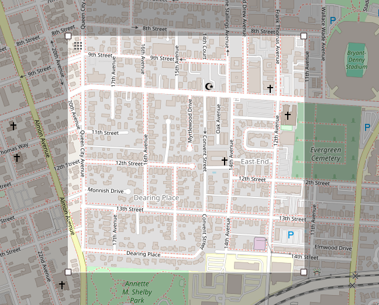

# CS 460: Final Project

## Part 3: Autonomous Controller

**_NOTE:_** Due to a recent update to `ros2_control`, the autonomous controller crashes when it is run in the Webots simulation (see this [Pull Request](https://github.com/cyberbotics/webots_ros2/pull/1011)). This same error was encountered when dealing with unmodified versions of the homework 1 code using the exact instructions provided in the project. Attempts were made to roll `ros2_control` back to an older version, but these were unsuccessful. Since the controller successfully navigated the lab environment, we suspect that it would successfully navigate the simulated environment with only minor modifications.

### Approach

The controller uses a wall-following approach to navigate the environment. Using LiDAR to identify obstacles and walls in the environment, the robot avoids obstacles while slowly navigating the environment. The robot's avoidance distance would likely have to be tweaked to best match the simulated environments. At regular intervals, the robot turns 360 degrees to improve its coverage of the environment and help identify AprilTags further away.

One shortcoming of this approach is that the robot could potentially latch onto an interior wall, preventing the robot from navigating the whole room.

The following worlds were selected for this project:
- `maze.wbt`
- `maze1_smallest.wbt`

### Running Instructions

An [online random number generator](https://www.calculator.net/random-number-generator.html?slower=0&supper=100&ctype=1&s=6264&x=Generate) was used to randomize the starting locations of the robot. The world files were manually modified to reflect the randomized locations.


The shell scripts in the file simplify the process of executing the code by specifying the world, clearing the old `build` and `install` folders, rerunning `colcon build`, and sourcing the necessary scripts. To run the first world (`maze.wbt`), run the following command from this current directory:

```bash
bash run_maze.sh
```


To run the second world (`maze1_smallest.wbt`), run the following command from this current directory:

```bash
bash run_maze_smallest.sh
```

To run the robot controller, run the following command from another terminal while one of the worlds is running:

```bash
bash run_robobot.sh
```

### Results

Due to the previously mentioned error stemming from the `ros2_control` update, the code was not able to be successfully run in Webots. Based on the results of the control running in the lab, we expect the coverage of the robot to be approximately 50-90%. However, this might be lower in some trials if no modifications are made to insure that the robot does not get stuck in a room or stick to following an interior wall.

## Part 2: Outdoor World (Section of Tuscaloosa)

The outdoor world models an 800m-by-800m section of Tuscaloosa. This section of Tuscaloosa is located directly southwest of Bryant-Denny Stadium. This world was created with the help of the [OpenStreetMap Importer](https://cyberbotics.com/doc/automobile/openstreetmap-importer).




To run this world, simply navigate to this current directory and run the following script:

```bash
bash run_outdoor_sim.sh
```

The outdoor world models the general road network of the city, with special attention paid to the intersections. Note, however, that the details of the roads are not very fleshed out outside of the northwestern portion of the map, since the OSM to Webots converter does handle many of the details of the roads.

## Part 1: Indoor World (Bruno Business Library 1st Floor)

The indoor world models the first floor of the Angelo Bruno Business Library.


To run this world, simply navigate to this current directory and run the following script:

```bash
bash run_indoor_sim.sh
```

If you would like to change any of the doors in the simulation, modify the final value in the `rotation` field for the given door in the `bruno-business-library.wbt` file. Note that this can also be done within the Webots simulation. 

```
Door {
  translation 35.5 1 0
  rotation 0 0 1 -1.5707953071795862
  name "door(13)"
  jointAtLeft FALSE
  doorHandle DoorLever {
    rotation 0 1 0 0.00131724
    jointAtLeft FALSE
    hasStaticParent TRUE
  }
}
```

