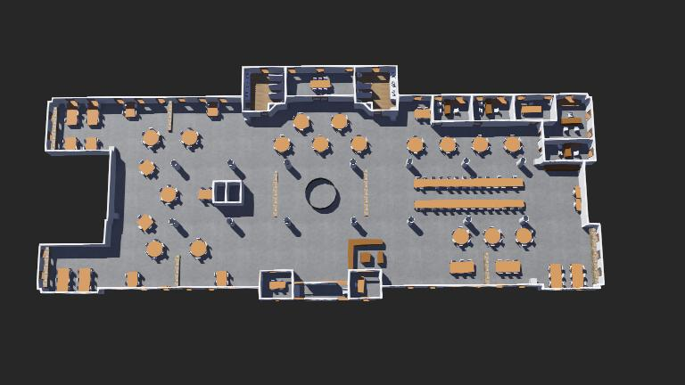

# CS 460: Final Project Worlds

This repository contains an indoor and outdoor worlds for Webots.

## Indoor World (Bruno Business Library 1st Floor)

The indoor world models the first floor of the Angelo Bruno Business Library.

## Outdoor World (Section of Tuscaloosa)

The outdoor world models an 800m-by-800m section of Tuscaloosa. This section of Tuscaloosa is located directly southwest of Bryant-Denny Stadium. This world was created with the help of the [OpenStreetMap Importer](https://cyberbotics.com/doc/automobile/openstreetmap-importer).

## Setup
